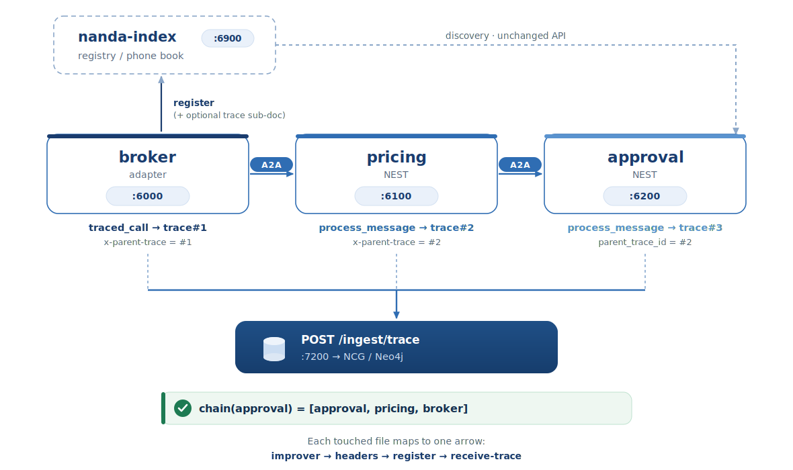

<!--
Render with Marp:
  npx @marp-team/marp-cli docs/merge.md -o docs/merge.html
  npx @marp-team/marp-cli docs/merge.md --pptx -o docs/merge.pptx
Speaker notes are the HTML comments under each slide.
-->

# Merge Plan
## What changes in each repo — and why

adapter · NEST · nanda-index

Alexis Ngoga · for the NANDA Writing Group

<!-- This deck is the file-level companion to the proposal. One slide per repo, plus the exact reason for each file touched. Source of truth: the three PR docs + INFRASTRUCTURE_AND_CHANGES.md. -->

---

# Scope of the merge

Four separate git repos. One new repo + three small PRs — **not** one big commit.

| Target repo | Files touched | New files | Breaking? |
|---|---|---|---|
| **nanda-context-graph** | (new repo) | entire service | n/a |
| **projnanda/adapter** | `core/nanda.py`, `core/agent_bridge.py` | — | No |
| **projnanda/NEST** | `core/agent_bridge.py`, `telemetry/__init__.py` | `telemetry/trace_collector.py` | No |
| **projnanda/nanda-index** | `registry.py` | — | No |

<!-- Five existing files touched across three repos, plus one new file in NEST. Each maintainer reviews only their own repo. -->

---

# The rule that governs every change

> **Every hook is gated on the `NCG_INGEST_URL` environment variable.
> Unset = transparent pass-through. The agent behaves exactly as before.**

- All trace emission is **fire-and-forget** on a daemon thread
- All hook code is wrapped in `try/except` — it never crashes the agent
- All A2A header and registration additions are **additive** — old peers ignore them

<!-- Say this once, up front. Every file slide that follows is an instance of this rule. It's what makes each PR a five-minute review. -->

---

# Repo 1 — adapter · files affected

| File | Status | What changes |
|---|---|---|
| `nanda_adapter/core/nanda.py` | modified | trace emission + improver wrapper |
| `nanda_adapter/core/agent_bridge.py` | modified | trace context + A2A headers + registration field |

Both are existing files. No new files. No new dependencies.

<!-- The adapter is where an agent's own reasoning runs (the improver) and where it delegates over A2A. Both touched files are exactly those two seams. -->

---

# adapter · `core/nanda.py` — what & why

<div class="small">

| Addition | What it does | Why here |
|---|---|---|
| `NCG_INGEST_URL` global | master on/off switch, read once at import | single, explicit gate |
| `_emit_trace(trace)` | fire-and-forget `POST /ingest/trace`, swallows errors | never block/crash the agent |
| `traced_call(fn, msg, agent_id, parent_trace_id)` | wraps the improver, builds + emits a `DecisionTrace` | the improver **is** the agent's reasoning step |
| `register_custom_improver()` wrap | wraps improver only when tracing is on; else registers raw | zero overhead when off |

</div>

**Why this file:** the adapter's reasoning happens in the improver. Wrapping it
captures the decision **without touching the agent's logic**.

<!-- The improver is the function the developer wrote. We wrap it, we don't change it. When NCG_INGEST_URL is unset, register_custom_improver registers the raw function — identical to today. -->

---

# adapter · `core/agent_bridge.py` — what & why

<div class="small">

| Addition | What it does | Why here |
|---|---|---|
| `_trace_ctx` thread-local + `get/set_trace_context()` | carries the active trace id across the request | delegation happens later in the same request |
| headers in `send_to_agent()` | adds `x-trace-id`, `x-parent-trace`, `x-reason` to outgoing A2A | the only way the next agent can link back |
| `trace` sub-doc in `register_with_registry()` | adds `trace.endpointURL` to registration when enabled | index can advertise who traces |

</div>

**Why this file:** delegation is an HTTP hop to another process. Headers are the
only channel that survives the hop and lets the receiver link to its caller.

<!-- agent_bridge is the routing layer. The thread-local holds the trace id from the moment the improver runs until send_to_agent fires. Old indexes/agents simply ignore the extra headers and the extra registration field. -->

---

# adapter · correctness fixes (in the NCG path)

Surfaced only by running a **real 3-process** demo, not in-process tests:

- **One module instance.** Force the package `core/` dir onto `sys.path` so the
  relative `agent_bridge` import succeeds. A prior fallback loaded a *second*
  top-level module → two thread-locals → trace context invisible across them.
- **Use the star-imported `set_trace_context`** (the module the running bridge
  uses), not a fresh relative import.
- **Don't clear the context in `finally`.** Delegation can fire *after* the
  improver returns and needs the trace id live; it's overwritten next call.
- **`x-parent-trace` = this agent's own trace_id** (the delegator), so the
  receiver links to its immediate caller — previously it sent the grandparent.

<!-- These are honest, real fixes — list them; don't hide them. They are all inside the NCG-added path, so they only matter when tracing is on. They're the reason the chain links correctly across processes. -->

---

# Repo 2 — NEST · files affected

| File | Status | What changes |
|---|---|---|
| `nanda_core/telemetry/trace_collector.py` | **new** | the collector singleton |
| `nanda_core/telemetry/__init__.py` | modified | exports `trace_collector` |
| `nanda_core/core/agent_bridge.py` | modified | hooks around `handle_message` + outgoing header |

One new file, two modified. No new dependencies (reuses `requests`).

<!-- NEST already has a telemetry/ package and a conversation_id on every A2A message — we add into that package and reuse that id, so there are no new concepts. -->

---

# NEST · `telemetry/trace_collector.py` (NEW) — what & why

<div class="small">

| Method | What it does |
|---|---|
| `before_call(agent_id, conversation_id, message, parent_trace_id)` | opens a trace skeleton, returns a fresh `trace_id` |
| `current_trace_id(conversation_id)` | innermost in-flight `trace_id`, to stamp `x-parent-trace` on delegations |
| `after_call(conversation_id, response, outcome)` | finalizes + fire-and-forget emits the `DecisionTrace` |

</div>

- Keyed by `conversation_id` → **LIFO stack** of in-flight skeletons, so nested /
  concurrent calls on one conversation don't overwrite each other.
- When `NCG_INGEST_URL` is unset, **every method is a silent no-op.**

**Why a new file:** it's the bridge from NEST's existing A2A lifecycle to NCG —
self-contained, deletable, and reuses `conversation_id` as `a2a_msg_id`.

<!-- The LIFO stack is the fix that removed the earlier concurrency caveat. Each turn gets its own trace_id; the conversation id is preserved as a2a_msg_id so you can still group a whole conversation. -->

---

# NEST · `core/agent_bridge.py` — what & why

<div class="small">

| Addition | What it does | Why here |
|---|---|---|
| guarded import of `trace_collector` | `try/except`; `None` if unavailable | safe if telemetry absent |
| `handle_message()` → `before_call` / `after_call` | reads `x-parent-trace`, traces the call, records `success`/`delegated`/`error` | NEST's receive path actually reasons (`process_message`) |
| `_ncg_after_call()` helper | centralized, exception-swallowing finalizer | one place to record outcome |
| header in `_send_to_agent()` | stamps `x-parent-trace = current_trace_id(...)` outward | a delegating NEST agent extends the chain |

</div>

**Why this file:** unlike the adapter, NEST **reasons on receive**, so it's the
natural specialist/approver — it links its trace to whoever called it.

<!-- This is why NEST plays the pricing + approval nodes in the demo: it reasons when it receives, and chains onward when it delegates. All hook code is in try/except — a failure in tracing never breaks message handling. -->

---

# Repo 3 — nanda-index · file affected

| File | Status | What changes |
|---|---|---|
| `registry.py` | modified | store optional `trace` sub-doc on `POST /register` |

One line of intent, in one handler:

```python
registry['agent_status'][agent_id] = {
    ...,
    'trace': data.get('trace', {}),   # absent in old payloads ⇒ {}
}
```

**Why this file:** discovery already maps `@id → URL`; with one optional field it
can also say *where an agent's trace endpoint lives* — no new required schema.

<!-- Smallest change of the three. No schema enforcement, no new required fields, no change to existing fields. Old agents that send no trace store {} and behave identically. Note: the trace sub-doc is NOT propagated through switchboard/federation lookups — out of scope here. -->

---

# How the pieces line up at runtime



<!-- Tie it together: nanda.py builds trace#1, agent_bridge.py stamps the header, registry.py stored the trace endpoint, NEST's collector + bridge produce trace#2 and #3 and link them. The SVG already carries the "each touched file maps to one arrow" caption. -->

---

# Verification (actual, run)

| Check | Result |
|---|---|
| Adapter integration proof | 11/11 |
| NEST integration proof | 12/12 |
| Collector unit (push/pop/current/drain + nested same-conversation) | pass |
| Query API | pass |
| Real 3-process distributed demo (3-hop chain) | pass |
| With `NCG_INGEST_URL` unset | no behavior change |

Run: `python run_demo.py` (Phase 6 is the distributed proof).

<!-- These are the actual results from the test scripts and the distributed orchestrator, not projections. -->

---

# One thing to flag to the adapter maintainer

`nanda_adapter/core/agent_bridge.py` contains a **pre-existing** hardcoded
`SMITHERY_API_KEY` fallback — **not introduced by this work.**

Since our adapter PR touches that file, a reviewer may notice it.
Flagging for awareness; it can be addressed separately.

<!-- Honesty point. We didn't add it, but our diff sits in the same file. Better to call it out than have a reviewer think it's ours. -->

---

# Summary — the merge in one view

- **5 existing files** touched across 3 repos + **1 new file** in NEST
- Every change **opt-in** via `NCG_INGEST_URL`; unset = identical behavior
- Each repo is an **independent, small PR**, reviewed by its own maintainer
- Verified end-to-end by a **real 3-process, 2-framework** demo

> Nothing in any repo changes behavior until an operator sets `NCG_INGEST_URL`.

**Docs:** `MERGE_PROPOSAL.md` · `INFRASTRUCTURE_AND_CHANGES.md` · `pr/PR-adapter.md` · `pr/PR-nest.md` · `pr/PR-nanda-index.md`

<!-- Close on the same rule you opened with. The reviewer's risk is bounded: opt-in, additive, per-repo, and demonstrated. -->
