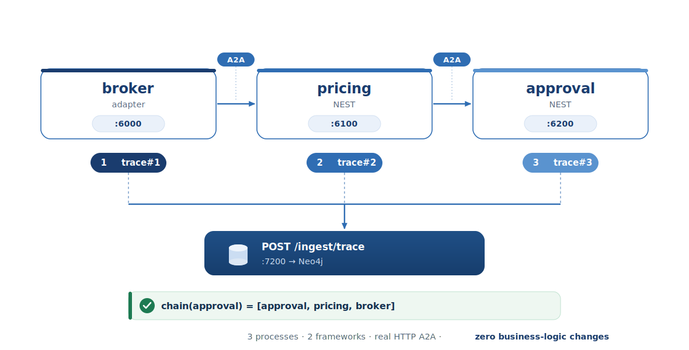

<!--
Render this deck with Marp:
  npx @marp-team/marp-cli docs/slides.md -o docs/slides.pdf      # PDF
  npx @marp-team/marp-cli docs/slides.md --pptx -o docs/slides.pptx
  npx @marp-team/marp-cli docs/slides.md -o docs/slides.html     # HTML
Or use the "Marp for VS Code" extension (preview + export buttons).
Speaker notes are the HTML comments under each slide.
-->

# nanda-context-graph
## Causal decision tracing for the Internet of Agents

Alexis Ngoga · for the NANDA Writing Group

<!-- One sentence: "I built the layer that tells you WHY agents did what they did — and I want to merge it into projnanda." -->

---

# The problem, in one question

The NANDA stack makes agents **discoverable, persistent, interoperable.**

But when a multi-agent decision goes wrong, we can't answer:

> **"What reasoning produced this action — and what caused what across agents?"**

<!-- Today the answer lives in scattered per-process logs that never join up. That is the gap. -->

---

# Where each repo sits

| Repo | Answers |
|---|---|
| **adapter** | expose + route `@agent` messages |
| **nanda-index** | where does `@agent-id` live (phone book) |
| **NEST** | run a reasoning agent with telemetry |
| **NCG (new)** | **what did each agent decide, why, what caused what** |

<!-- Identity, discovery, messaging exist. Explainability doesn't. That's NCG. -->

---

# What "causal tracing" means

A → delegates to B → B consults C → C calls a tool.
NCG records each agent's reasoning as a **node** and links cause→effect into **one graph**.

```
(:Agent)◄─MADE_BY─(:Decision)─DECIDED_BECAUSE─►(:Step thought, tool)
(:Decision)─PRECEDED_BY─►(:Decision)   ← the cross-agent causal chain
```

<!-- This is the artifact that makes an agent network auditable. -->

---

# The one rule (why it's safe to merge)

> **Every hook is gated on `NCG_INGEST_URL`.
> Unset = transparent pass-through.**

- Fire-and-forget on a daemon thread — never blocks the request path
- Everything wrapped in `try/except` — never crashes an agent
- Old agents that send no trace register and talk exactly as before

<!-- Lead with this. It's what lets a maintainer say yes to each PR in five minutes. -->

---

# Model-agnostic — bring any model, or none

- NCG **never calls an LLM** and **never needs an API key**
- `DecisionTrace` has **no model field** — Gemini, GPT, rules, or human emit the same shape
- The `ANTHROPIC_API_KEY` in demos is only the *example agent's* reasoning, not tracing
- Registration needs only `agent_id` + `agent_url`

> "Tracing is orthogonal to reasoning."

<!-- Swap anthropic → google-generativeai and nothing in NCG changes. -->

---

# How an agent connects — 3 steps

1. Set `NCG_INGEST_URL` + a unique `AGENT_ID`
2. Wrap logic in `NANDA(fn)` (adapter) **or** `AgentInterface.process_message` (NEST)
3. Register in the index (already automatic for the adapter)

Everything else — trace emission, header propagation, causal linking, storage — is **automatic.**

<!-- The integration surface for a new agent is two env vars and the wrapper they already use. -->

---

# The merge structure — 4 repos, not 1 commit

| Target | Change | Breaking? |
|---|---|---|
| nanda-context-graph | new repo (ingest, query, store, dashboard) | n/a |
| adapter | `traced_call` + trace headers + opt-in trace doc | No |
| NEST | new `trace_collector.py` + `before/after_call` | No |
| nanda-index | store optional `trace` sub-doc | No |

Each PR ships its own `CHANGES_FOR_NCG.md`; cover doc: `INFRASTRUCTURE_AND_CHANGES.md`.

<!-- Three tiny PRs, each reviewed by its own maintainer, plus one new repo. -->

---

# Continuing conversations — the granularity

- **`conversation_id` = the thread** → carried as `a2a_msg_id`, constant across turns
- **`trace_id` = one decision** → fresh UUID per message handled
- "Everything in conversation X" → group by `a2a_msg_id`
- "What caused this decision" → follow `PRECEDED_BY`

Concurrent/nested calls on one conversation are handled by a **LIFO stack** per id.

<!-- A conversation is a thread of many decisions, not one. The stack fix removes the earlier concurrency caveat. -->

---

# Live demo — a real 3-hop chain



<!-- The SVG carries the "3 processes · 2 frameworks · real HTTP A2A · zero business-logic changes" caption. Run `python run_demo.py` → Phase 6. Then show Neo4j Browser + the why() query live. -->

---

# See it three ways

- **Dashboard** `:8080` — search an agent, see its decisions + steps
- **Neo4j Browser** `:7474`
  `MATCH p=(d:Decision)-[:PRECEDED_BY*]->(root) RETURN p`
- **Query API** `:7201`
  `GET /api/v1/why?agent_id=rental-approval`

<!-- Three audiences: operators, graph people, and programmatic consumers. -->

---

# The ask

1. Transfer/fork **nanda-context-graph** into `projnanda`
2. Merge the three opt-in PRs (adapter, NEST, nanda-index)
3. Adopt **`NCG_INGEST_URL` opt-in** as the standard tracing seam

> **Nothing changes until an operator sets `NCG_INGEST_URL`.**

<!-- Close: "This makes the Internet of Agents auditable — without asking anyone to change how they build agents." -->

---

# Appendix — likely questions

- **Perf overhead?** One daemon-thread POST per decision; request path untouched.
- **What if NCG is down?** Fire-and-forget swallows the error; agent unaffected.
- **PII?** `NCG_PRIVACY_MODE` + `NCG_PII_FIELDS` redaction; private/zkp on roadmap.
- **Why Neo4j?** Causal chains are graph traversals (`PRECEDED_BY*`) — native fit.
- **Federation across registries?** 5A last-write-wins MERGE done; CRDT is 5B.

<!-- Keep these in your back pocket; don't present unless asked. -->
